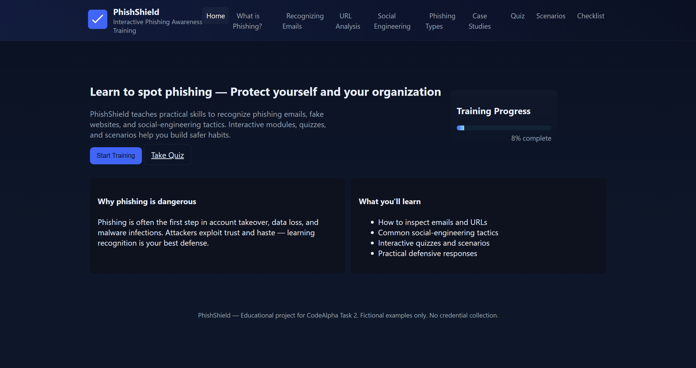
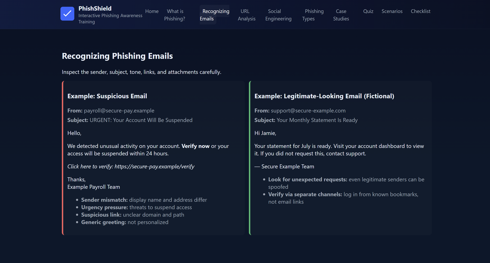
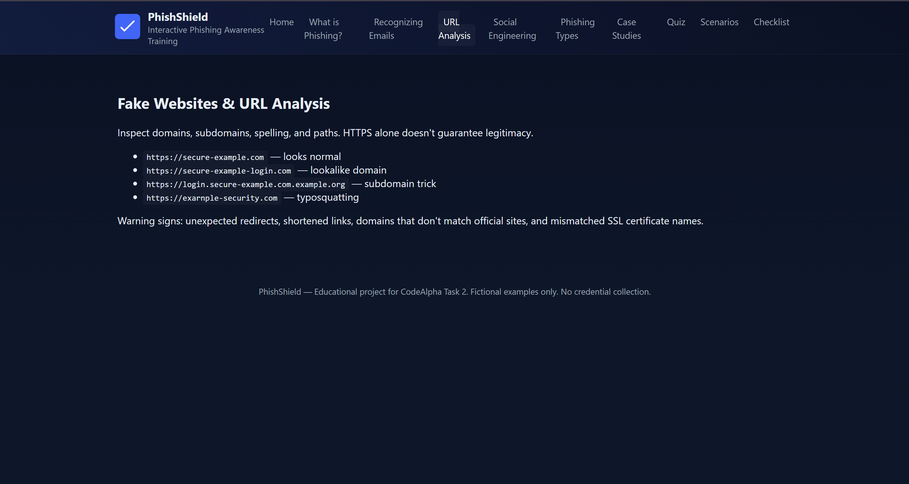
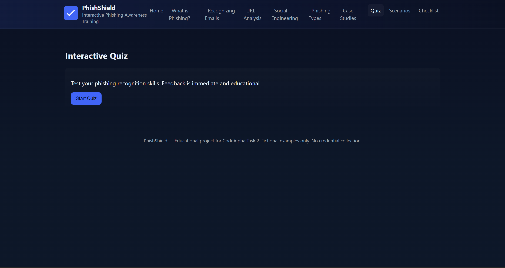
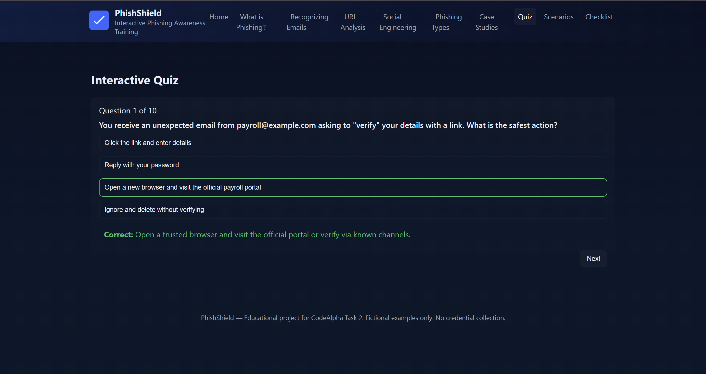
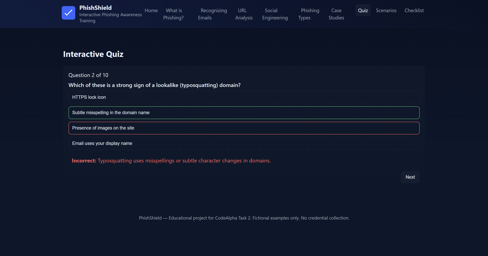
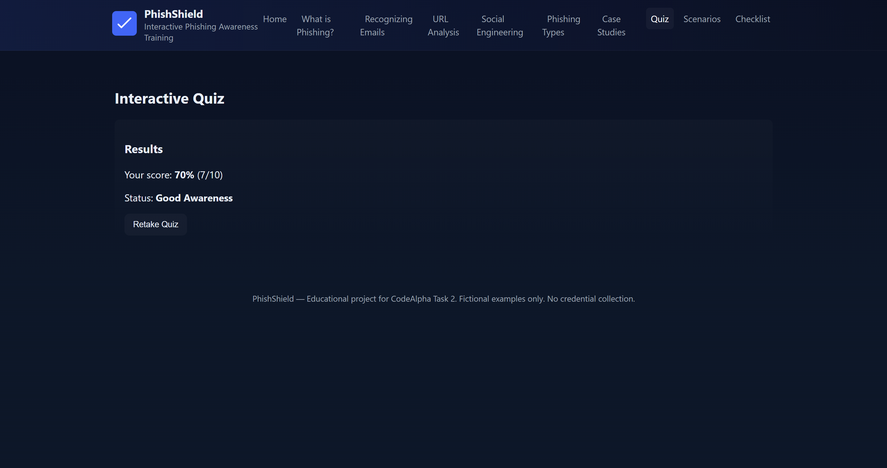
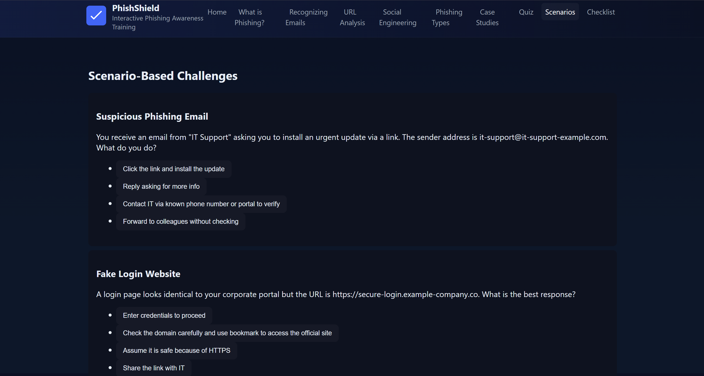
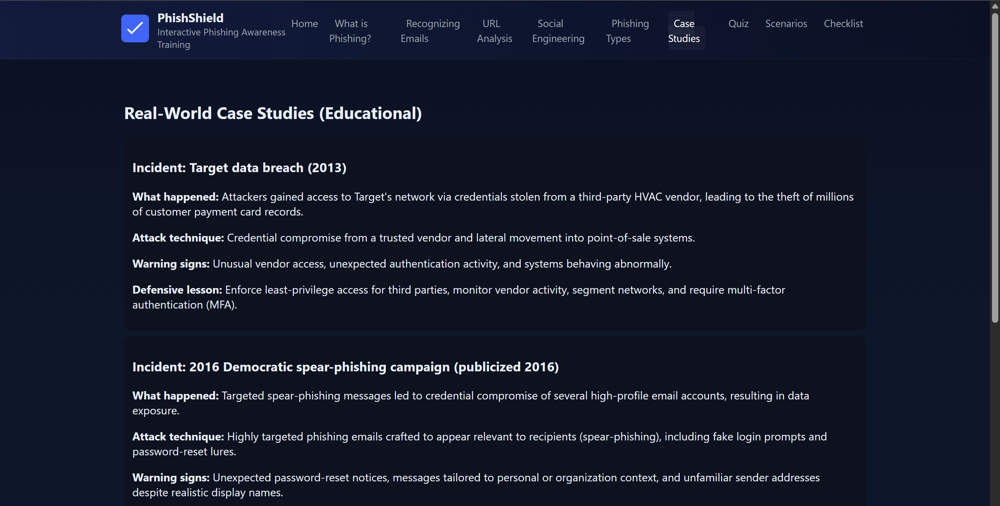
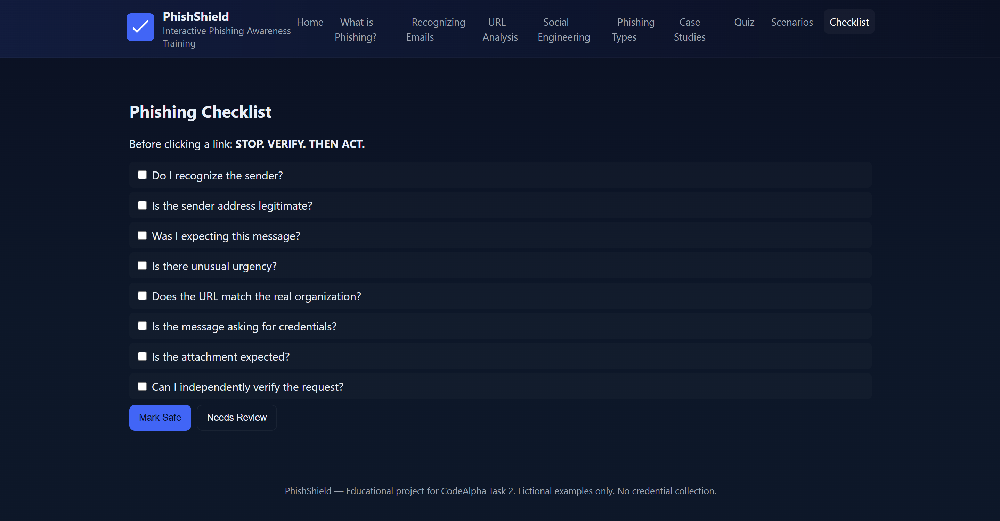

# PhishShield – Phishing Awareness Training

## Project Overview
PhishShield is an interactive, static web application designed for CodeAlpha Task 2: Phishing Awareness Training. It teaches users how to identify phishing emails, analyze URLs, understand social-engineering techniques, and respond defensively.

> **Defensive only:** all examples are fictional and safe. The project does not collect credentials, host malicious content, or perform tracking.

## Objectives
- Explain how to recognize phishing emails and fake websites
- Educate users on social-engineering tactics
- Provide best practices and defensive actions
- Include interactive quizzes and scenario challenges

## Features
- Polished responsive landing page
- Educational modules covering phishing fundamentals
- Interactive 10-question quiz with immediate feedback
- 3 scenario-based challenges with explanations
- Interactive phishing checklist
 - 3 real-world case studies (educational summaries of notable incidents)
- Progress tracking and completion screen

### Dashboard / Landing Page / Training Overview

PhishShield teaches practical skills to recognize phishing emails, fake websites, and social-engineering tactics. Interactive modules, quizzes, and scenarios help users build safer habits.



*Screenshot: The landing page (Dashboard) showing the training overview and progress card.*

### Recognizing Phishing Emails

Inspect the sender, subject, tone, links, and attachments carefully.



*Screenshot: A fictional suspicious email example with highlighted indicators to teach recognition.*

### URL Analysis

Inspect domains, subdomains, spelling, and paths. HTTPS alone doesn't guarantee legitimacy.



*Screenshot: URL analysis examples demonstrating lookalike domains and subdomain tricks.*

## Technologies Used
- HTML5
- CSS3
- Vanilla JavaScript

## Project Structure
```
PhishShield/
├── index.html
├── css/
│   └── style.css
├── js/
│   └── app.js
├── assets/
│   └── (optional assets)
├── README.md
└── .gitignore
```

## How to Run Locally
1. Clone or download the `PhishShield` folder.
2. Open `index.html` in a modern browser (Chrome, Edge, Firefox).

No build tools or servers are required.

## How to Deploy with GitHub Pages
1. Create a new repository on GitHub (e.g., `phishshield`).
2. Push the `PhishShield` folder contents to the repository root.
3. In repository Settings → Pages, select the `main` branch (or `gh-pages`) and root `/` as the publishing source.
4. After publishing, the site will be available at `https://<username>.github.io/<repo>/`.

## Interactive Quiz
- 10 multiple-choice questions
- Immediate feedback with explanations
- Score calculation and categories (Excellent/Good/Needs Improvement/High Risk)



*Screenshot: The general quiz interface where users answer questions and receive immediate feedback.*



*Screenshot: Example of immediate correct-answer feedback with an explanation.*



*Screenshot: Example of immediate incorrect-answer feedback with an explanation.*



*Screenshot: Final quiz results and score summary displayed after completion.*

## Scenario Challenges
- 3 interactive scenarios: suspicious email, fake login site, social-engineering call



*Screenshot: Interactive scenario-based challenges that present realistic decision points and show the correct defensive responses.*

## Security & Ethical Considerations
- No credentials, no tracking, and no malicious links are included.
- All examples and case studies are fictional and educational.

### Real-World Case Studies

Educational summaries of notable incidents are included to illustrate how phishing and social-engineering are used in real attacks. These case studies are presented for defensive learning only and do not contain operational details.



*Screenshot: Examples of real-world case studies with lessons and defensive guidance.*

## Testing Performed
- Verified navigation, quiz flow, scenarios, checklist, and completion screens in the static app context.
- Ensure responsiveness and keyboard focus states.

### Phishing Checklist / Defensive Checklist

An interactive checklist helps users verify key items before clicking links or acting on requests: recognize the sender, confirm legitimacy, check for urgency, and verify via independent channels.



*Screenshot: The interactive phishing checklist interface used to guide verification before action.*

## Future Improvements
- Add printable checklist and downloadable quick reference
- Localizable strings for multiple languages
- Optional SCORM wrapper for LMS integration (non-malicious)

## Screenshots Recommended for Submission
- Landing page with progress card
- Example suspicious email with highlights
- Quiz question with feedback shown
- Scenario challenge with explanation
- Completion screen showing final score

---
PhishShield is a defensive cybersecurity training prototype built for learning and awareness.
